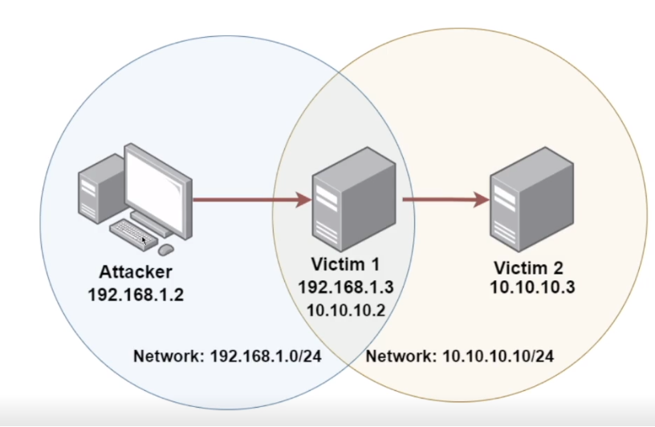

# Pivoting en Ciberseguridad

## Introducción
El pivoting es una técnica esencial en el mundo de la ciberseguridad que implica moverse lateralmente dentro de una red comprometida para acceder a sistemas y recursos adicionales. Esta técnica es utilizada por los profesionales de seguridad para mantener y expandir el acceso a través de una infraestructura comprometida.

## ¿Qué es el Pivoting?
En términos sencillos, el pivoting se refiere a la acción de utilizar una máquina comprometida como punto de entrada para acceder a otros sistemas dentro de la red. Esta técnica es particularmente útil cuando se ha obtenido acceso a un sistema perimetral y se busca infiltrarse en segmentos de red más internos.

## Tipos de Pivoting
Existen varios tipos de pivoting en función de cómo se realiza el movimiento lateral:

- **Pivoting Directo:** Se realiza desde la máquina comprometida hacia otros sistemas dentro de la misma red.
- **Pivoting a Través de Saltos:** Implica moverse a través de múltiples máquinas comprometidas para alcanzar el objetivo deseado.
- **Pivoting en Cadena:** Consiste en conectar varios sistemas comprometidos para llegar a la red objetivo.

## Herramientas y Técnicas
Para llevar a cabo el pivoting, los profesionales de seguridad utilizan herramientas y técnicas específicas, como:

- **SSH Túneles:** Establecer conexiones seguras a través de SSH para redirigir tráfico.
- **Proxychains:** Enrutamiento de tráfico a través de una cadena de proxies.
- **Port Forwarding:** Redireccionamiento de puertos para acceder a servicios internos.
- **VPN y Socks:** Uso de VPN o servidores SOCKS para ocultar el origen del tráfico.

## Importancia en la Ciberseguridad
El pivoting es una habilidad crucial para los analistas de seguridad y los pentesters, ya que les permite comprender la amplitud de una infracción y evaluar la exposición potencial en una red comprometida. Además, ayuda a identificar y remediar posibles puntos de entrada y movimiento lateral en futuros ataques.

## Caso Práctico

